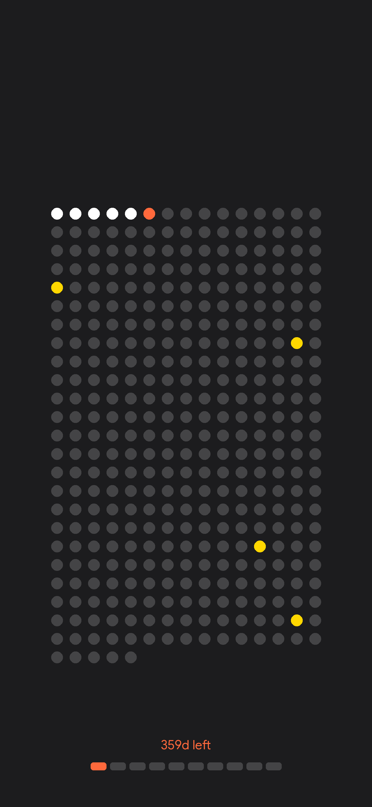

# Daily Year Progress Widget 📅

An automated Python script that generates a minimalist visualization of the current year. It updates every night at **12:00 AM IST** via GitHub Actions and hosts the result on GitHub Pages.

## 🔴 Live Preview
*(This image updates automatically every day)*

## 🎨 Legend
The grid represents all 365/366 days of the year.

* ⚪ **White Dots:** Days that have passed.
* 🟠 **Orange Dot:** Today.
* ⚫ **Gray Dots:** Future days.
* **Text:** Shows how many days are left in the year.

## 🔗 How to Use
You can use the raw image URL in any external application (widgets, wallpapers, dashboards).

**https://the-rebooted-coder.github.io/Daily-Dots-Widget/daily_status.png**
